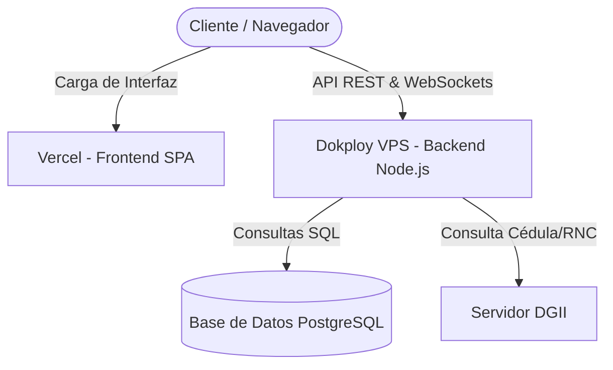

# 🚀 Guía de Despliegue en Vercel — Visitas Hub RD

Esta guía explica detalladamente cómo desplegar el **Frontend (SPA en React + Vite)** de **Visitas Hub RD** en **Vercel**, manteniendo la integración en tiempo real por WebSockets y conexión a base de datos en tu servidor existente (**Dokploy/VPS**).

---

## 📐 Resumen de la Arquitectura de Despliegue

Para un sistema corporativo con requerimientos en tiempo real como **Visitas Hub RD**, la arquitectura recomendada y más estable es una **arquitectura híbrida**:



### ¿Por qué esta estructura?
1. **Frontend en Vercel:** Proporciona tiempos de carga ultrarrápidos (gracias a su red de distribución global Edge), certificados SSL automáticos, y despliegues automáticos con cada `git push` a tu repositorio.
2. **Backend en Dokploy/VPS:** Vercel es un entorno **Serverless (sin estado)**. Las funciones Serverless tienen límites de ejecución cortos (máximo 10-60 segundos) y no admiten conexiones TCP persistentes. Como **Visitas Hub RD** utiliza **WebSockets (Socket.io)** para actualizar el Dashboard y los Checkpoints en tiempo real, el backend **debe** correr en un servidor persistente como tu Dokploy actual (`31.97.100.82`), el cual mantiene el socket abierto de forma indefinida y maneja eficientemente el pool de conexiones a PostgreSQL.

---

## 🛠️ Paso 1: Configuración de Rutas (Completado y Sincronizado)

En una SPA (Single Page Application) con React Router, si refrescas la página en rutas como `/dashboard` o `/visits`, Vercel arrojará un error `404 Not Found` porque intentará buscar un archivo físico en ese directorio.

Para solucionarlo, hemos creado y subido el archivo **[vercel.json](file:///e:/Empresas/GMV/Proyectos%20Antigravity/SistemaVisitasLocal/VisitFlow-React/vercel.json)** en la carpeta `VisitFlow-React/` con las siguientes instrucciones de redirección:

```json
{
  "cleanUrls": true,
  "rewrites": [
    {
      "source": "/(.*)",
      "destination": "/index.html"
    }
  ]
}
```

> [!NOTE]
> Este archivo ya fue añadido al repositorio y sincronizado exitosamente con tu GitHub en la rama `main` (`https://github.com/HmesaG/vhRD.git`).

---

## ⚡ Paso 2: Desplegar el Frontend en Vercel

Sigue estos sencillos pasos en la interfaz de Vercel:

1. **Iniciar Sesión:** Ingresa a [Vercel](https://vercel.com/) y entra a tu Dashboard.
2. **Añadir Nuevo Proyecto:**
   * Haz clic en el botón **"Add New..."** y selecciona **"Project"**.
3. **Importar Repositorio:**
   * Conecta tu cuenta de GitHub (si aún no lo has hecho).
   * Busca e importa tu repositorio: **`vhRD`** (`HmesaG/vhRD`).
4. **Configurar el Proyecto (Monorepo Settings):**
   * **Project Name:** `visitas-hub-rd` (o el nombre que prefieras).
   * **Framework Preset:** Selecciona **`Vite`** (Vercel lo autodetectará).
   * **Root Directory:** Haz clic en **"Edit"** y selecciona la carpeta **`VisitFlow-React`**. *Esto es crucial ya que el repositorio contiene tanto el servidor como el cliente.*
5. **Configuración de Construcción (Build and Development Settings):**
   * Vercel configurará automáticamente:
     * **Build Command:** `npm run build`
     * **Output Directory:** `dist`
     * **Install Command:** `npm install`
6. **Configurar Variables de Entorno (Environment Variables):**
   * Despliega la pestaña de **"Environment Variables"**.
   * Agrega la siguiente variable esencial para que la SPA sepa a qué servidor Dokploy hacer consultas:
     * **Key:** `VITE_API_URL`
     * **Value:** `http://31.97.100.82:3001` *(o el dominio/puerto público donde tengas expuesta la API en Dokploy)*
7. **Desplegar:**
   * Haz clic en el botón **"Deploy"**.
   * ¡En menos de 2 minutos tu frontend estará publicado en una URL gratuita de vercel (ej: `https://visitas-hub-rd.vercel.app`)!

---

## 🔒 Paso 3: Configurar CORS en el Backend (Dokploy)

Dado que tu frontend ahora estará alojado en un dominio de Vercel (`https://tu-app.vercel.app`) y el backend está en tu VPS Dokploy, debes asegurarte de que el servidor permita las peticiones CORS (Cross-Origin Resource Sharing) provenientes de Vercel.

1. Ve a la consola de **Dokploy** donde está corriendo tu contenedor `api`.
2. En las **Variables de Entorno** del contenedor `api`, edita la variable `CORS_ORIGIN`.
   * Si deseas permitir el acceso exclusivo desde tu nuevo dominio de Vercel, configúrala así:
     ```env
     CORS_ORIGIN=https://tu-app-en-vercel.vercel.app
     ```
   * Si prefieres permitir cualquier origen temporalmente para pruebas:
     ```env
     CORS_ORIGIN=*
     ```
3. Guarda los cambios y **reinicia/despliega nuevamente** el servicio de la `api` en Dokploy.

---

## 📈 Conclusiones y Prácticas Recomendadas

* **Integración Continua:** Cada vez que hagas un cambio en la carpeta `VisitFlow-React` y lo subas a GitHub (`git push`), Vercel detectará el cambio automáticamente, compilará la aplicación y la publicará en producción en segundos sin interrumpir el servicio.
* **Caché Eficiente:** Vercel se encarga de la compresión gzip/brotli, minificación de activos estáticos y almacenamiento en caché perimetral de forma totalmente transparente y sin costo de mantenimiento.
* **Monitoreo:** Puedes verificar los logs de carga directamente en la consola de despliegues de Vercel en caso de que alguna dependencia de React 19 necesite ajustes.
